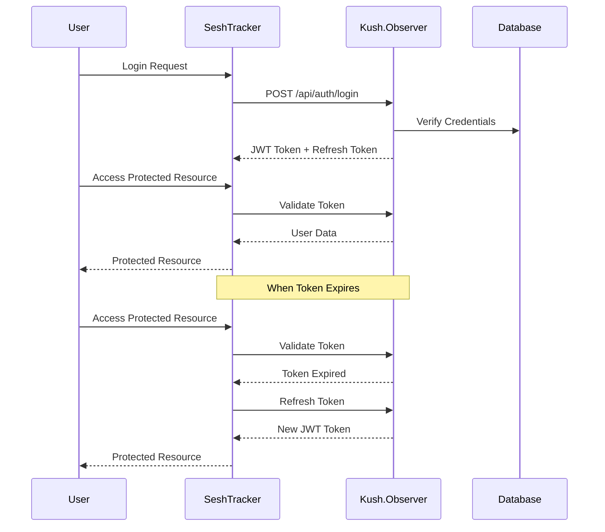

# Authentication Integration Guide

This document outlines how SeshTracker and Kush.Observer should integrate their authentication systems.

## Authentication Flow



## System Responsibilities

### Kush.Observer Responsibilities

1. **User Authentication**
   - Maintain user database
   - Validate credentials
   - Generate and sign JWT tokens
   - Manage token refresh

2. **User Data Management**
   - Store user profiles
   - Manage subscription status
   - Provide user data API

3. **Token Validation**
   - Validate token authenticity
   - Check token expiration
   - Return user data on valid tokens

### SeshTracker Responsibilities

1. **Authentication UI**
   - Login/registration forms
   - Password reset flow
   - Handle authentication errors

2. **Token Management**
   - Store tokens securely (HttpOnly cookies)
   - Refresh tokens when expired
   - Handle authentication state

3. **Authorization Logic**
   - Control access to features based on user data
   - Show/hide UI elements based on subscription

## Implementation Guidelines

### JWT Token Format

```json
{
  "sub": "user_123",
  "email": "user@example.com",
  "name": "John Doe",
  "subscription": {
    "status": "active",
    "plan": "premium"
  },
  "iat": 1683654321,
  "exp": 1683657921
}
```

### Error Handling

1. **Invalid Credentials**
   - Kush.Observer returns 401 status
   - SeshTracker shows appropriate error message

2. **Expired Token**
   - First attempt token refresh
   - If refresh token is expired, redirect to login

3. **Network Failures**
   - Implement retry logic (3 attempts)
   - Show offline mode if available

## Security Considerations

1. **Token Storage**
   - Use HttpOnly cookies for JWT
   - Store refresh token in secure cookie

2. **CSRF Protection**
   - Include CSRF token in requests
   - Validate on server-side

3. **Rate Limiting**
   - Kush.Observer should implement rate limiting
   - SeshTracker should handle 429 responses 