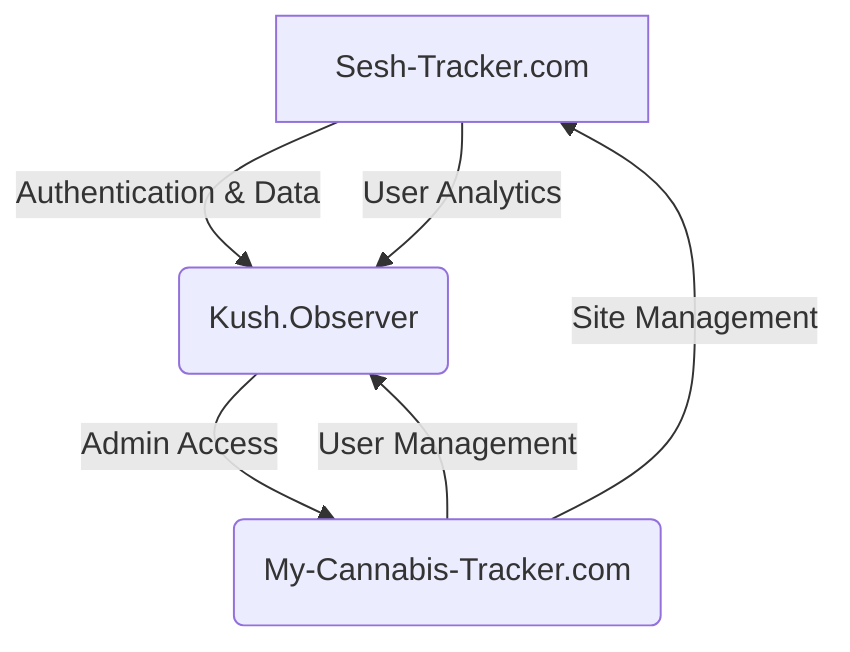
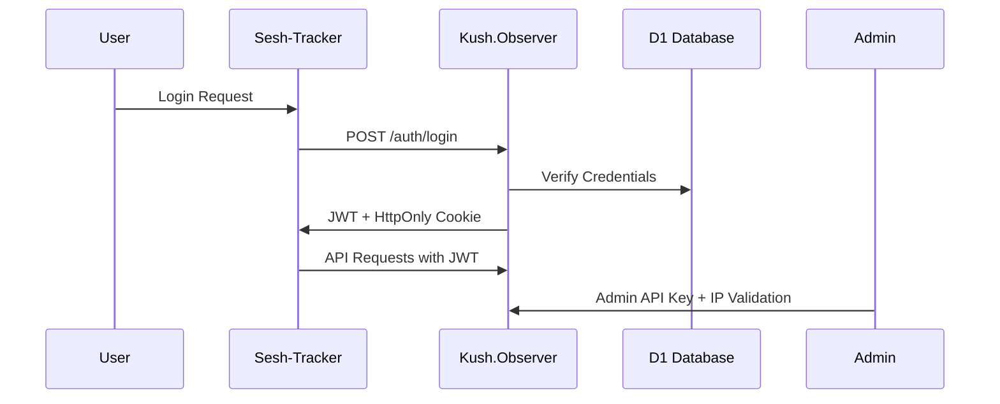

# SeshTracker Ecosystem Organization

## 📊 Ecosystem Architecture



## 🏢 Repository Structure

### 1. Sesh-Tracker.com (Main User Interface)
**Repository:** [seshtrackerv2](https://github.com/seshtrackerdev/seshtrackerv2)

```
seshtrackerv2/
├── .cursor/                  # AI assistant configuration
│   ├── RULES.md             # Project-specific AI guidelines
│   ├── WORKFLOWS/           # Common task automations
│   ├── REFERENCES/          # Code snippets and patterns
│   └── index.ts             # Barrel exports
│
├── src/                      # Source code
│   ├── react-app/           # React frontend application
│   │   ├── components/      # UI components
│   │   │   ├── dashboard/   # Dashboard widgets
│   │   │   ├── inventory/   # Inventory management
│   │   │   ├── sessions/    # Session tracking
│   │   │   ├── common/      # Shared components
│   │   │   └── layouts/     # Page layouts
│   │   ├── hooks/           # Custom React hooks
│   │   ├── pages/           # Top-level pages
│   │   ├── contexts/        # React contexts (auth, etc.)
│   │   └── utils/           # Frontend utilities
│   │
│   ├── api/                 # Backend API using Hono
│   │   ├── routes/          # API route handlers
│   │   ├── middleware/      # Request middlewares
│   │   └── kush-proxy/      # Kush.Observer integrations
│   │
│   ├── types/               # TypeScript type definitions
│   │   ├── strain.ts        # Cannabis strain types
│   │   ├── session.ts       # Tracking session types
│   │   └── user.ts          # User profile types
│   │
│   └── config/              # Configuration files
│       ├── constants.ts     # Application constants
│       └── env.ts           # Environment variables
│
├── public/                   # Static assets
│   ├── images/              # Image assets (no duplication)
│   ├── branding/            # Logo and branding assets
│   └── legacy/              # Legacy code (old versions)
│
├── tests/                    # Test files
│   ├── unit/                # Unit tests
│   ├── integration/         # API integration tests
│   └── _fixtures/           # Test fixtures/mocks
│
├── docs/                     # Documentation
│   ├── ARCHITECTURE.md      # System architecture
│   ├── API.md               # API documentation
│   ├── KUSH_INTEGRATION.md  # Kush.Observer integration
│   └── ADMIN_FEATURES.md    # Admin dashboard features
│
├── development-plan/         # Development roadmap
│   ├── ROADMAP.md           # Project timeline
│   ├── FEATURES.md          # Feature specifications
│   └── phases/              # Phase-specific plans
│
├── migrations/               # D1 database migrations
└── scripts/                  # Automation scripts
    ├── cleanup.ps1          # Code organization script
    ├── deploy.ps1           # Deployment automation
    └── build.ps1            # Build process script
```

### 2. Kush.Observer (Authentication & Data Storage)
**Repository:** [kushobserver](https://github.com/seshtrackerdev/kushobserver)

```
kushobserver/
├── src/
│   ├── auth/               # Authentication logic
│   │   ├── jwt.ts          # JWT implementation
│   │   ├── providers/      # Auth providers
│   │   └── middleware.ts   # Auth middleware
│   │
│   ├── db/                 # Database operations
│   │   ├── models/         # Data models
│   │   ├── migrations/     # D1 migrations
│   │   └── schema.ts       # Database schema
│   │
│   ├── api/                # API routes
│   │   ├── users/          # User management endpoints
│   │   ├── sessions/       # Session tracking endpoints
│   │   ├── inventory/      # Inventory endpoints
│   │   ├── strains/        # Cannabis strain endpoints
│   │   └── admin/          # Admin-only endpoints
│   │
│   └── utils/              # Utility functions
│       ├── validators.ts   # Input validation
│       └── logging.ts      # Error logging
│
├── migrations/             # D1 database migrations
├── tests/                  # Test files
└── docs/                   # Documentation
    ├── API.md              # API documentation
    └── SECURITY.md         # Security implementation
```

### 3. My-Cannabis-Tracker.com (Admin Dashboard)
**Repository:** [seshadmindash](https://github.com/seshtrackerdev/seshadmindash)

```
seshadmindash/
├── src/
│   ├── pages/              # Admin dashboard pages
│   │   ├── users/          # User management
│   │   ├── analytics/      # Usage analytics
│   │   ├── subscriptions/  # Subscription management
│   │   └── settings/       # System settings
│   │
│   ├── components/         # UI components
│   │   ├── data-tables/    # Data visualization
│   │   ├── charts/         # Analytics charts
│   │   └── forms/          # Admin forms
│   │
│   ├── api/                # Admin API client
│   │   ├── kush/           # Kush.Observer API integration
│   │   └── sesh/           # Sesh-Tracker API integration
│   │
│   └── utils/              # Utility functions
│
├── public/                 # Static assets
└── docs/                   # Documentation
```

## 🔄 Shared Types & Standards

### Data Types Repository
Consider creating a shared types package:

```
sesh-ecosystem-types/
├── src/
│   ├── strain.ts          # Cannabis strain definitions
│   ├── session.ts         # Session tracking interfaces
│   ├── user.ts            # User profile interfaces
│   └── index.ts           # Barrel exports
├── package.json
└── tsconfig.json
```

### API Standards
Create a consistent API response format across all services:

```typescript
interface APIResponse<T> {
  success: boolean;
  data?: T;
  error?: string;
  meta?: {
    page?: number;
    limit?: number;
    total?: number;
  };
}
```

## 🔐 Security Implementation

### Authentication Flow



### Environment Variables

**Sesh-Tracker.com**
```env
KUSH_OBSERVER_URL=https://kush.observer/api/v1
ENVIRONMENT=production|development
```

**Kush.Observer**
```env
JWT_SECRET=your_secret_here
D1_DATABASE_ID=your_d1_id
ADMIN_ALLOWED_IPS=1.2.3.4,5.6.7.8
```

**Admin Dashboard**
```env
KUSH_ADMIN_API_KEY=your_admin_key
KUSH_OBSERVER_URL=https://kush.observer/api/admin
```

## 📦 Integration Testing

```
tests/
├── e2e/
│   ├── sesh-kush-auth.spec.ts     # Auth integration
│   ├── sesh-kush-data.spec.ts     # Data flow
│   └── admin-kush-manage.spec.ts  # Admin features
│
├── _fixtures/
│   ├── mock-strains.json         # Cannabis strain test data
│   ├── mock-sessions.json        # Session tracking test data
│   └── mock-users.json           # Test user accounts
│
└── scripts/
    ├── setup-test-env.js         # Test environment setup
    └── reset-test-data.js        # Clean database between tests
```

## 🚀 Deployment Strategy

**Multi-Environment Setup**
```
├── dev.sesh-tracker.com      # Development environment
├── staging.sesh-tracker.com  # Staging environment
└── sesh-tracker.com          # Production environment
```

**Corresponding Worker Environments**
```
├── kush-observer-dev      # Development D1 instance
├── kush-observer-staging  # Staging D1 instance
└── kush-observer          # Production D1 instance
```

## 📊 Documentation Standards

Create standardized documentation for all repositories:

- `README.md` - Project overview
- `ARCHITECTURE.md` - System design
- `API.md` - API documentation
- `CONTRIBUTING.md` - Contribution guidelines
- `SECURITY.md` - Security practices
- `CHANGELOG.md` - Version history

## 📝 Implementation Checklist

1. Create `.cursor/` directory for AI assistant configuration
2. Standardize environment variables across all three services
3. Create shared type definitions for cross-service consistency
4. Implement comprehensive test fixtures for cannabis data
5. Document API endpoints with consistent response formats
6. Set up multi-environment deployment configurations
7. Create end-to-end tests for critical user flows 