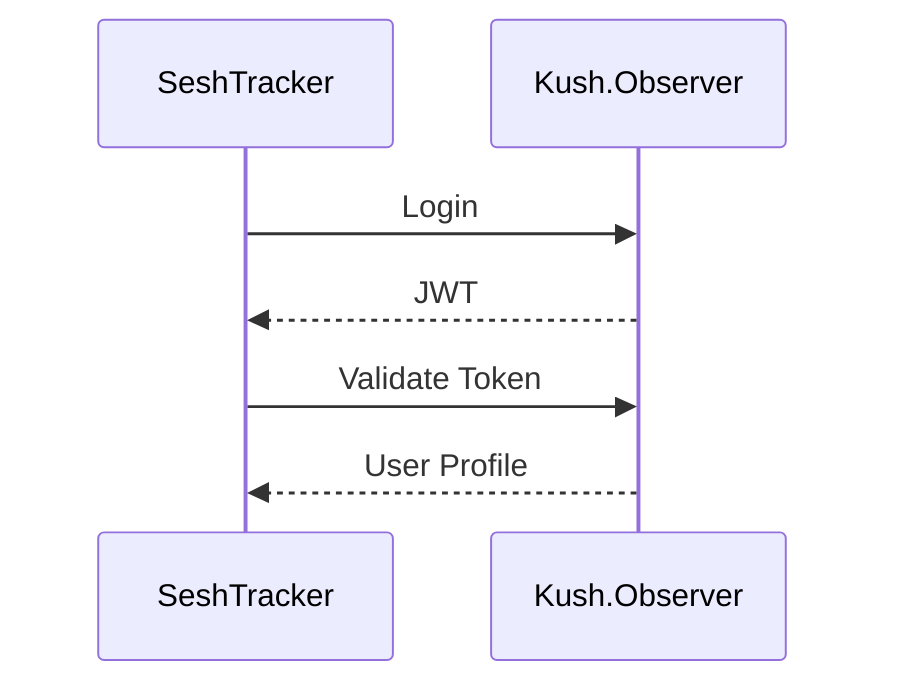

# 📘 SeshTracker Architecture & Frontend System Guide

This document consolidates architecture, component structure, CSS theming, and integration practices for the SeshTracker ecosystem. It replaces and merges the contents of:

- `architecture.md`
- `COMPONENTS.md`, `component-organization.md`
- `CSS.md`, `css-organization.md`
- `MOBILE-FIRST.md`, `mobile-first-theme.md`
- `INTEGRATION.md`, `KUSH-OBSERVER.md`

---

## ⚙️ System Architecture Overview

## 🧭 System Architecture (Detailed)

This application is a modern edge-deployed, serverless system consisting of:

- **Frontend**: SPA built with React and Vite (`src/react-app/`)
  - `Pages`: Top-level route components (e.g., `HomePage`)
  - `Components`: UI elements (e.g., `Button`, `Header`)
  - `Hooks`: Custom logic (`useAuth`)
  - `Services/API`: Abstracted fetch logic
  - `Styles`: Global and component-specific CSS

- **Backend**: Cloudflare Worker using Hono (`src/worker/`)
  - `Routes`: API endpoints
  - `Middleware`: Auth, logging, error handling
  - `Services`: Business logic

### 🔄 Request Lifecycle

1. React app sends a request to `/api/...`
2. Local dev (Vite) or Cloudflare Pages proxies to the Worker
3. Worker processes the request and talks to:
   - Kush.Observer (auth)
   - Cloudflare D1 (sessions/inventory)
4. JSON response is returned and rendered by the SPA

### ⚙️ Deployment Pipeline

- **Frontend**: `vite build` to `dist/`, deployed via Cloudflare Pages
- **Backend**: Built with `wrangler`, deployed via Cloudflare Workers
- **Routing**: Pages proxies `/api/*` to Worker API

- **Frontend**: React + Vite SPA
- **Backend**: Cloudflare Worker (Hono)
- **Database**: Cloudflare D1 (sessions, inventory)
- **Deployment**: Wrangler, `wrangler.json` configuration

### Data Flow
1. User accesses the React SPA
2. UI makes API requests to relative `/api/...` endpoints
3. Requests routed to the Worker, which processes logic and proxies as needed (e.g., Kush.Observer)
4. Response returned and handled in frontend

---

## 🧩 Component Architecture (Feature-Based)

Directory: `src/react-app/components/`

```
components/
  ├── auth/        // Login, registration
  ├── common/      // Shared UI (Header, Footer)
  ├── dashboard/   // Analytics and reporting
  ├── inventory/   // Product inventory
  ├── sessions/    // Session logging and review
  ├── profile/     // User settings and display
  ├── layouts/     // Route-level wrappers
  ├── ui/          // Design system: Button, Card, Modal
  └── landing/     // Home/marketing views
```

### Import Pattern (Barrel Exports)

Each folder has an `index.ts` that re-exports components. Root-level `components/index.ts` re-exports everything.

```ts
// Global usage:
import { Dashboard, Header } from '../components';
```

---

## 🎨 CSS + Theming

### Structure

```
src/
  └── styles/
       ├── index.css          // Global entry point
       ├── variables.css      // Theme tokens
       ├── themes.css         // Light/Dark definitions
       └── feature.css        // Dashboard.css, LandingPage.css
```

### Conventions

- **Component styles**: Co-located as `Component.tsx + Component.css`
- **Utility classes**: Defined in `utilities.css`
- **Media queries**: Use mobile-first, embed in component CSS

### CSS Variables (Theme Tokens)

```css
:root {
  --accent-color: #43a047;
  --spacing-sm: 0.5rem;
  --text-primary: #333;
}
[data-theme="dark"] {
  --text-primary: #eee;
}
```

---

## 📱 Mobile-First Design System

- Default layout targets **mobile-first**
- Spacing, button tap targets, and readability prioritized for mobile
- `min-width` media queries scale content up on larger screens

### Semantic UI Elements

- `.btn.btn-primary`
- `.card`
- `.form-input`

### Spacing System

| Variable         | Value     |
|------------------|-----------|
| `--spacing-xs`   | 4px       |
| `--spacing-sm`   | 8px       |
| `--spacing-md`   | 16px      |
| `--spacing-lg`   | 24px      |
| `--spacing-xl`   | 32px      |

---

## 🔐 Kush.Observer Integration

### Token-Based Auth Flow



- All `/api/...` routes in the Worker require a valid JWT.
- Tokens validated via `POST /api/auth/validate-token`
- Responses include `userId`, expiration, and permissions

### Auth Header Format

```http
Authorization: Bearer <JWT>
```

---

## 🧪 Integration Environment

```env
# Kush.Observer
KUSH_ENDPOINT=https://kush.observer/api/v2
KUSH_API_KEY=your_key

# Admin Dashboard
ADMIN_API_ENDPOINT=https://my-cannabis-tracker.com/v3
ADMIN_API_KEY=your_admin_key
```

---

## ✅ Integration Best Practices

| Issue                         | Solution                                 |
|------------------------------|------------------------------------------|
| Token Expiry                 | Auto-refresh or logout on failure        |
| Deep Nested Imports          | Barrel exports + import script enforcement |
| CORS Errors                  | Use Worker proxy layer                   |
| Mobile Performance           | Minimize CSS and JS payload              |

---

## 🧰 Supporting Scripts

- `update-imports.sh`: Normalize component import paths
- `verify-imports.sh`: Detect fragile paths or incorrect usage
- `apply-migration.js`: Apply D1 schema locally and remotely
- `test-connection.js`: Validate auth and DB integration across environments

---

By consolidating architecture, styles, integration, and structure, this documentation provides a complete and unified view of the SeshTracker frontend and ecosystem.
