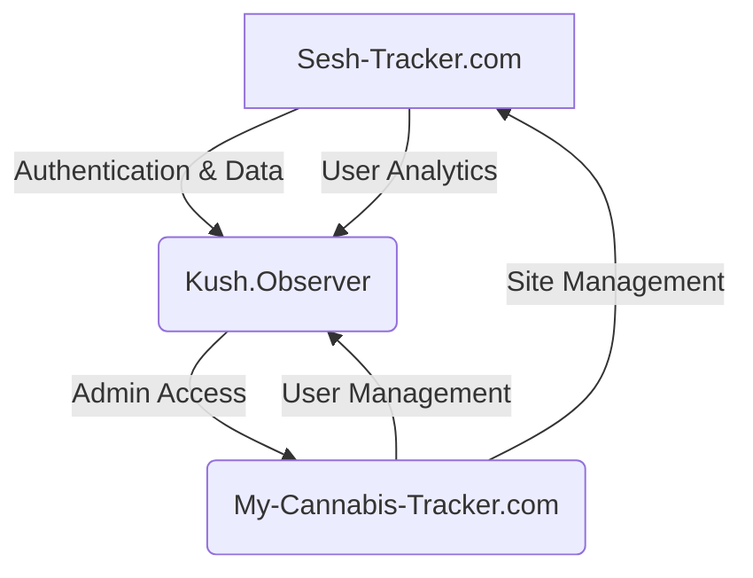
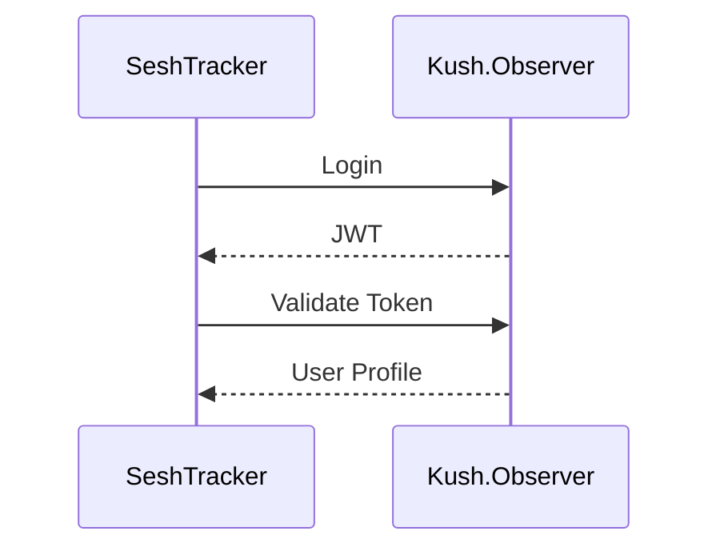
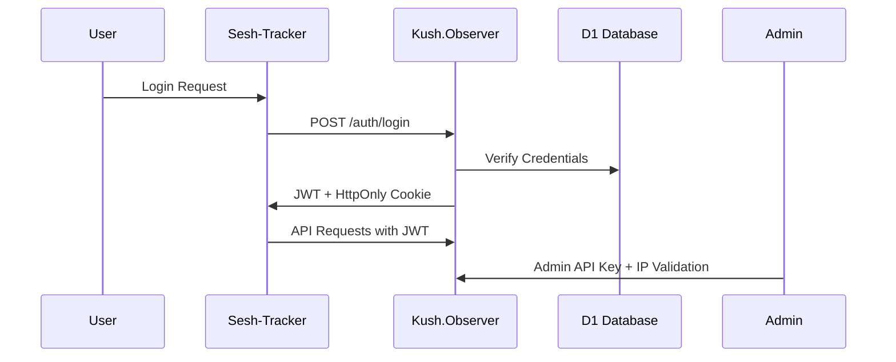

# 📘 SeshTracker Architecture & Ecosystem Integration

This document consolidates architecture, component structure, CSS theming, and integration practices for the SeshTracker ecosystem. It replaces and merges the contents of:

- `SeshTracker-Ecosystem-Organization.md`
- `architecture.md`
- `COMPONENTS.md`, `component-organization.md`
- `CSS.md`, `css-organization.md`
- `MOBILE-FIRST.md`, `mobile-first-theme.md`
- `INTEGRATION.md`, `KUSH-OBSERVER.md`

---

## 📊 Ecosystem Architecture



## ⚙️ System Architecture Overview

This application is a modern edge-deployed, serverless system consisting of:

- **Frontend**: SPA built with React and Vite (`src/react-app/`)
  - `Pages`: Top-level route components (e.g., `HomePage`)
  - `Components`: UI elements (e.g., `Button`, `Header`)
  - `Hooks`: Custom logic (`useAuth`)
  - `Services/API`: Abstracted fetch logic
  - `Styles`: Global and component-specific CSS

- **Backend**: Cloudflare Worker using Hono (`src/worker/`)
  - `Routes`: API endpoints
  - `Middleware`: Auth, logging, error handling
  - `Services`: Business logic

### 🔄 Request Lifecycle

1. React app sends a request to `/api/...`
2. Local dev (Vite) or Cloudflare Pages proxies to the Worker
3. Worker processes the request and talks to:
   - Kush.Observer (auth)
   - Cloudflare D1 (sessions/inventory)
4. JSON response is returned and rendered by the SPA

### ⚙️ Deployment Pipeline

- **Frontend**: `vite build` to `dist/`, deployed via Cloudflare Pages
- **Backend**: Built with `wrangler`, deployed via Cloudflare Workers
- **Routing**: Pages proxies `/api/*` to Worker API

- **Frontend**: React + Vite SPA
- **Backend**: Cloudflare Worker (Hono)
- **Database**: Cloudflare D1 (sessions, inventory)
- **Deployment**: Wrangler, `wrangler.json` configuration

### Data Flow
1. User accesses the React SPA
2. UI makes API requests to relative `/api/...` endpoints
3. Requests routed to the Worker, which processes logic and proxies as needed (e.g., Kush.Observer)
4. Response returned and handled in frontend

## 🏢 Repository Structure

### Sesh-Tracker.com (Main User Interface)
**Repository:** [seshtrackerv2](https://github.com/seshtrackerdev/seshtrackerv2)

```
seshtrackerv2/
├── src/                      # Source code
│   ├── react-app/           # React frontend application
│   │   ├── components/      # UI components
│   │   │   ├── dashboard/   # Dashboard widgets
│   │   │   ├── inventory/   # Inventory management
│   │   │   ├── sessions/    # Session tracking
│   │   │   ├── common/      # Shared components
│   │   │   └── layouts/     # Page layouts
│   │   ├── hooks/           # Custom React hooks
│   │   ├── pages/           # Top-level pages
│   │   ├── contexts/        # React contexts (auth, etc.)
│   │   └── utils/           # Frontend utilities
│   │
│   ├── api/                 # Backend API using Hono
│   │   ├── routes/          # API route handlers
│   │   ├── middleware/      # Request middlewares
│   │   └── kush-proxy/      # Kush.Observer integrations
│   │
│   ├── types/               # TypeScript type definitions
│   │   ├── strain.ts        # Cannabis strain types
│   │   ├── session.ts       # Tracking session types
│   │   └── user.ts          # User profile types
│   │
│   └── config/              # Configuration files
│       ├── constants.ts     # Application constants
│       └── env.ts           # Environment variables
│
├── public/                   # Static assets
│   ├── images/              # Image assets (no duplication)
│   ├── branding/            # Logo and branding assets
│   └── legacy/              # Legacy code (old versions)
│
├── tests/                    # Test files
│   ├── unit/                # Unit tests
│   ├── integration/         # API integration tests
│   └── _fixtures/           # Test fixtures/mocks
│
├── docs/                     # Documentation
│   ├── architecture/        # System architecture
│   ├── api/                 # API documentation
│   └── planning/            # Development and planning docs
│
├── migrations/               # D1 database migrations
└── scripts/                  # Automation scripts
    ├── cleanup.ps1          # Code organization script
    ├── deploy.ps1           # Deployment automation
    └── build.ps1            # Build process script
```

## 🧩 Component Architecture (Feature-Based)

Directory: `src/react-app/components/`

```
components/
  ├── auth/        // Login, registration
  ├── common/      // Shared UI (Header, Footer)
  ├── dashboard/   // Analytics and reporting
  ├── inventory/   // Product inventory
  ├── sessions/    // Session logging and review
  ├── profile/     // User settings and display
  ├── layouts/     // Route-level wrappers
  ├── ui/          // Design system: Button, Card, Modal
  └── landing/     // Home/marketing views
```

### Import Pattern (Barrel Exports)

Each folder has an `index.ts` that re-exports components. Root-level `components/index.ts` re-exports everything.

```ts
// Global usage:
import { Dashboard, Header } from '../components';
```

## 🎨 CSS + Theming

### Structure

```
src/
  └── styles/
       ├── index.css          // Global entry point
       ├── variables.css      // Theme tokens
       ├── themes.css         // Light/Dark definitions
       └── feature.css        // Dashboard.css, LandingPage.css
```

### Conventions

- **Component styles**: Co-located as `Component.tsx + Component.css`
- **Utility classes**: Defined in `utilities.css`
- **Media queries**: Use mobile-first, embed in component CSS

### CSS Variables (Theme Tokens)

```css
:root {
  --accent-color: #43a047;
  --spacing-sm: 0.5rem;
  --text-primary: #333;
}
[data-theme="dark"] {
  --text-primary: #eee;
}
```

## 📱 Mobile-First Design System

- Default layout targets **mobile-first**
- Spacing, button tap targets, and readability prioritized for mobile
- `min-width` media queries scale content up on larger screens

### Semantic UI Elements

- `.btn.btn-primary`
- `.card`
- `.form-input`

### Spacing System

| Variable         | Value     |
|------------------|-----------|
| `--spacing-xs`   | 4px       |
| `--spacing-sm`   | 8px       |
| `--spacing-md`   | 16px      |
| `--spacing-lg`   | 24px      |
| `--spacing-xl`   | 32px      |

## 🔐 Kush.Observer Integration

### Token-Based Auth Flow



- All `/api/...` routes in the Worker require a valid JWT.
- Tokens validated via `POST /api/auth/validate-token`
- Responses include `userId`, expiration, and permissions

### Auth Header Format

```http
Authorization: Bearer <JWT>
```

### Authentication Flow (Detailed)



## 🧪 Integration Environment

```env
# Kush.Observer
KUSH_ENDPOINT=https://kush.observer/api/v2
KUSH_API_KEY=your_key

# Admin Dashboard
ADMIN_API_ENDPOINT=https://my-cannabis-tracker.com/v3
ADMIN_API_KEY=your_admin_key
```

### Environment Variables

**Sesh-Tracker.com**
```env
KUSH_OBSERVER_URL=https://kush.observer/api/v1
ENVIRONMENT=production|development
```

**Kush.Observer**
```env
JWT_SECRET=your_secret_here
D1_DATABASE_ID=your_d1_id
ADMIN_ALLOWED_IPS=1.2.3.4,5.6.7.8
```

**Admin Dashboard**
```env
KUSH_ADMIN_API_KEY=your_admin_key
KUSH_OBSERVER_URL=https://kush.observer/api/admin
```

## ✅ Integration Best Practices

| Issue                         | Solution                                 |
|------------------------------|------------------------------------------|
| Token Expiry                 | Auto-refresh or logout on failure        |
| Deep Nested Imports          | Barrel exports + import script enforcement |
| CORS Errors                  | Use Worker proxy layer                   |
| Mobile Performance           | Minimize CSS and JS payload              |

## 🧰 Supporting Scripts

- `update-imports.sh`: Normalize component import paths
- `verify-imports.sh`: Detect fragile paths or incorrect usage
- `apply-migration.js`: Apply D1 schema locally and remotely
- `test-connection.js`: Validate auth and DB integration across environments

## 📦 Integration Testing

```
tests/
├── e2e/
│   ├── sesh-kush-auth.spec.ts     # Auth integration
│   ├── sesh-kush-data.spec.ts     # Data flow
│   └── admin-kush-manage.spec.ts  # Admin features
│
├── _fixtures/
│   ├── mock-strains.json         # Cannabis strain test data
│   ├── mock-sessions.json        # Session tracking test data
│   └── mock-users.json           # Test user accounts
│
└── scripts/
    ├── setup-test-env.js         # Test environment setup
    └── reset-test-data.js        # Clean database between tests
```

## 🚀 Deployment Strategy

**Multi-Environment Setup**
```
├── dev.sesh-tracker.com      # Development environment
├── staging.sesh-tracker.com  # Staging environment
└── sesh-tracker.com          # Production environment
```

**Corresponding Worker Environments**
```
├── kush-observer-dev      # Development D1 instance
├── kush-observer-staging  # Staging D1 instance
└── kush-observer          # Production D1 instance
```

---

By consolidating architecture, styles, integration, and structure, this documentation provides a complete and unified view of the SeshTracker frontend and ecosystem. 